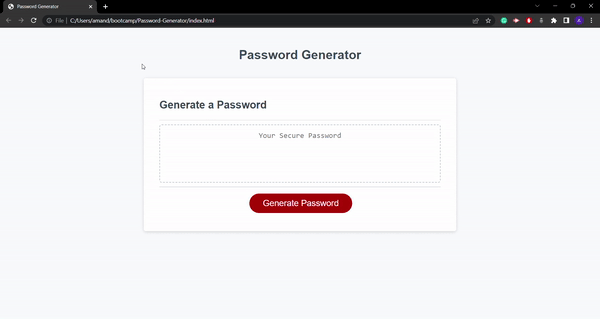

# Password-Generator

## Description

This password generator was created for a user to generate a random password based on the criteria they select. The application utilizes HTML, CSS, and JavaScript. 

## Installation

You can access the password generator using GitHub Pages. 

[Password Generator Link](https://acappleman.github.io/Password-Generator/)

## Usage

Below is a screen recording of the completed password generator and its functionality.

## Credits

Thanks to [w3schools](https://w3schools.com) and [MDN Web Docs](https://developer.mozilla.org/en-US/) for JavaScript tutorials. The special characters used in the password generator were defined by [The OWASP Foundation](https://owasp.org/www-community/password-special-characters). [ezgif](https://ezgif.com) was used to convert the screen recording into a gif.

## License

Please refer to the LICENSE in the repo.
